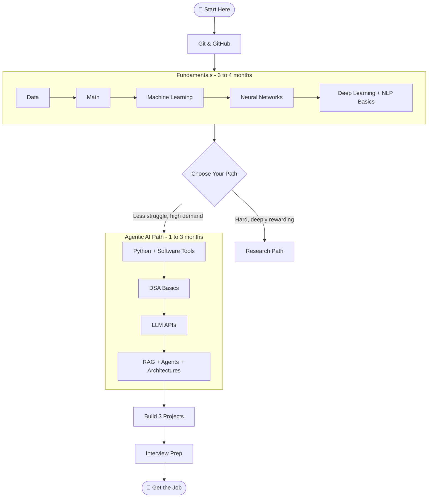

# Roadmap: Getting into AI Engineering (6 months is all you need)

> "The best time to start was yesterday. The second best time is right now. Stop reading motivational quotes and open your laptop." — Every senior engineer ever

---

## Your Journey at a Glance



---

## First Thing First — Learn Git

Think of Git like Instagram for developers. Instead of posting selfies, you post your code. GitHub is your portfolio — it stays with you from your first project to your last.

**What to learn:**
- `git init`, `git add`, `git commit`, `git push` — that's 80% of what you'll use daily
- Create a GitHub account and push every single thing you build, even if it's messy

> Don't wait until your project is "ready." Push the ugly stuff. Everyone's first repo is embarrassing. That's the point.

---

# Part 1 — Fundamentals (Must and Should)

> "You don't need to understand how an engine works to drive a car. But if your car breaks in the middle of nowhere, you'll wish you had paid attention in class."

---

## Data — 1 Month

Everything in AI starts with data. A model is only as good as the data it learned from. Before touching any model, you need to understand what data looks like and how to work with it.

**What to learn:**
- **Python basics** — variables, loops, functions, lists, dictionaries. This is your foundation. Don't skip it.
- **Pandas** — think of it as Excel but in code. Load data, clean data, explore data.
- **NumPy** — math on arrays. You'll use this more than you think.
- **SQL basics** — SELECT, WHERE, JOIN. Most company data lives in databases.
- **EDA (Exploratory Data Analysis)** — before you build anything, look at your data. Plot it. Ask questions.

**Quick example to make it click:**
Imagine you're building a chatbot for a hospital. Your data is patient records. If those records have typos, missing values, or wrong dates — your AI will give wrong answers. Garbage in, garbage out.

**Think about this:** What kind of data does YouTube use to decide what video to show you next?

---

## Math — 1 Week

Don't panic. You don't need a math degree. You need enough to understand *why* things work, not to derive them from scratch.

**Linear Algebra (2 days):**
- Vectors — just a list of numbers: `[0.2, 0.8, 0.5]`
- Matrices — a table of numbers
- Dot product — how similar are two vectors? (This is literally how search works in AI)

**Probability & Statistics (2 days):**
- Mean, median, standard deviation — how is data spread?
- Probability — what are the chances something happens?
- Bayes' Theorem (intuition only) — updating your belief when you get new information

**Calculus (1 day — intuition only):**
- Derivatives = rate of change = slope of a curve
- Gradient = direction of steepest climb (AI uses this to learn by going *downhill*)

> You don't need to solve integrals by hand. You need to understand that AI learning = "find the lowest point of the error curve." That's it. The rest is just details.

---

## Machine Learning — 1 Month

This is where things get interesting. ML is teaching computers to learn patterns from data without explicitly programming every rule.

### Supervised Learning
You give the model inputs AND the correct answers. It learns the pattern.

**Regression** — when you want to predict the numbers such as crickt score or House Price etc

| Model | What it does | When to use |
|---|---|---|
| **Linear Regression** | Draws a straight line through data | Simple relationships (e.g., hours studied → exam score) |
| **Polynomial Regression** | Draws a curve instead of a line | When the relationship isn't straight (e.g., speed → fuel consumption) |
| **Ridge / Lasso** | Linear regression + a penalty for complexity | When your model is overfitting — too good on training data, bad on new data |
| **Decision Tree** | Splits data into yes/no branches | Easy to explain, works on messy data |
| **Random Forest** | 100 decision trees vote together | More accurate than one tree, harder to overfit |
| **Gradient Boosting (XGBoost)** | Trees that learn from each other's mistakes | Competition-winning model. If in doubt, try this. |

> Why does this matter for later? Linear Regression teaches you loss functions and gradient descent — the same ideas that power neural networks. The math scales up, but the intuition is the same.

**Key concepts to understand alongside these:**
- **Train/Test Split** — never test on the data you trained on. That's like memorizing exam answers, not learning.
- **Overfitting** — model is too specific to training data, fails on real data
- **Underfitting** — model is too simple, misses the pattern entirely
- **Loss function** — how wrong is the model? (MSE for regression: average of squared errors)
- **Gradient Descent** — the algorithm that nudges the model to reduce that loss. This is the backbone of everything in deep learning.

**Classification** — when the output is a category (spam/not spam, cat/dog).
- **Logistic Regression** — despite the name, it's for classification. Outputs a probability between 0 and 1.
- Same tree-based models above work for classification too.
- **Key metric:** Accuracy, Precision, Recall — don't just trust accuracy, it lies on imbalanced data.

**Example:** You show the model 10,000 emails labeled "spam" or "not spam." It learns what spam looks like. Now show it a new email — it predicts.

### Unsupervised Learning
No correct answers given. The model finds structure on its own.

- **Clustering** — group similar things together (e.g., customer segments)
- **Key algorithm:** K-Means
- **Dimensionality Reduction** — PCA (simplifying data without losing too much info)

**Think about this:** Spotify groups listeners by taste without you telling it who you are. How does it know you and that other person both like lo-fi hip hop?

> One good course + one hands-on project beats five courses with zero practice. Always.

---

## Neural Networks — 1 Month

This is where ML gets its superpowers. Neural networks are loosely inspired by the human brain — layers of connected nodes that transform input into output.

**What to learn:**
- **Perceptron** — the simplest unit. Input → weighted sum → activation → output
- **Activation functions** — ReLU, Sigmoid, Softmax. They decide if a neuron "fires" or not
- **Layers** — input layer, hidden layers, output layer
- **Backpropagation** — how the network learns from its mistakes (calculus under the hood, but just understand the concept)
- **Loss functions** — how wrong is the model? Cross-entropy, MSE
- **Optimizers** — Adam, SGD. How the model updates its weights to get better

**The mental model:** Think of a neural network like a series of filters. Each layer asks a more complex question about the input. Layer 1: "Is there an edge here?" Layer 5: "Is this a cat?"

**Tools:** PyTorch (preferred in research), TensorFlow/Keras (easier to start)

---

## Deep Learning + NLP Basics

Deep learning = neural networks with many layers. NLP = making AI understand human language.

**You don't need to master this. You need to understand it well enough to work with Transformers.**

**What to skim:**
- **Word Embeddings** — words become vectors. "King" - "Man" + "Woman" ≈ "Queen". Wild, right?
- **RNNs** — old way of handling sequences. Struggled with long texts. Led to...
- **Attention Mechanism** — "pay more attention to the important words." This changed everything.
- **Transformers** — the architecture behind GPT, BERT, and every modern LLM. Read the "Attention Is All You Need" abstract (just the abstract, relax).

> The Transformer paper from 2017 is the reason you're reading this roadmap. It's that important.

---

# The Fork in the Road

```
You've completed the fundamentals. Now choose:

  [1] Agentic AI Path  →  Build apps with existing models
                          High demand. Faster to job-ready.
                          You = the engineer who makes AI useful.

  [2] Research Path    →  Train new models from scratch
                          Slower. Harder. Requires more math.
                          You = the person who builds the next GPT.
```

> Most people reading this should pick Path 1. There's no shame in that. The world desperately needs engineers who can build reliable, useful AI products. Research is great — but the market is begging for good AI engineers right now.

---

# Part 2 — AI Engineering: Agentic Path (1–3 Months)

---

## Software Fundamentals — 1 Month

You need to understand the code your AI is writing and be able to fix it when it breaks. Also, interviews will test this.

**Learn in this order:**

1. **Python** — if you skipped this earlier, stop. Come back. Python first.
2. **FastAPI** — build APIs. This is how your AI talks to the world.
3. **Pydantic** — data validation. Makes your inputs clean and predictable.
4. **Streamlit** — build quick UIs for your AI apps. Ship something that looks real.
5. **LangChain** — the glue between your code and LLMs.
6. **LangGraph** — for building agents that have memory and can make decisions.
7. **Basic System Design** — how do systems talk to each other? APIs, databases, queues.

> These tools are genuinely easier than they look. One afternoon with FastAPI and you'll have a working API. The fear is worse than the reality.

If you have a curious learner mindset, this section takes weeks. If you have "just need a job" energy, it takes forever and still doesn't stick. Be honest with yourself.

---

## DSA — 1 Month (Lighter than you think)

AI Engineering interviews are lighter on DSA than pure SWE roles. You won't be asked to implement a red-black tree. But you will be tested on fundamentals.

**Focus on:**
1. **HashMaps / Dictionaries** — most common data structure in real code
2. **Arrays** — slicing, indexing, two pointers
3. **Strings** — manipulation, reversal, substrings
4. **Two Pointers** — elegant solutions to array/string problems
5. **Basic patterns** — sliding window, prefix sum. These repeat constantly.

**Strategy:** Do 1 Leetcode Easy per day for a month. You'll start seeing patterns. That's the goal — pattern recognition, not memorization.

> Don't grind 300 Leetcode problems. Do 30 well-understood ones and you'll be fine for most AI Engineering roles.

---

## LLM APIs — 2 Weeks

This is what nobody puts on roadmaps but every AI job uses on day one.

**What to learn:**
- **OpenAI / Anthropic SDK** — how to call a model, send a prompt, get a response
- **Tokens** — LLMs don't read words, they read chunks. Tokens = cost. Understand this.
- **Temperature** — controls randomness. 0 = deterministic. 1 = creative. Don't ignore this.
- **Structured Outputs** — making the model return JSON instead of free text. Critical for production.
- **System prompts vs User prompts** — the difference matters more than you think
- **Cost awareness** — every API call costs money. Build with this in mind.

**Quick example:** Calling GPT-4 with a 10-page document on every user click will cost you a job. Learn to cache, chunk, and be efficient.

---

## Architectures in Agentic AI — Ordered by Priority

### 1. Prompt Engineering (Start here, always)
Before any architecture — learn to talk to the model properly.
- Be specific. Give context. Give examples. Tell it the format you want.
- Few-shot prompting: show 2–3 examples before your actual question
- Chain of Thought: tell it to "think step by step"

> A good prompt can make a small model beat a big one. This is the highest ROI skill in AI Engineering.

### 2. RAG — Retrieval Augmented Generation (90% of interviews, 90% of real jobs)
LLMs don't know your company's data. RAG fixes that.

**How it works:** User asks question → search your documents → feed relevant chunks to the LLM → get a grounded answer.

**What to learn:**
- **Vector Databases** — Pinecone, Weaviate, Chroma. Store and search embeddings.
- **Embeddings** — converting text to vectors so you can search by meaning, not keywords
- **Chunking** — splitting documents smartly. Too big = irrelevant noise. Too small = missing context.
- **Retrieval** — finding the right chunks from thousands of documents
- **Reranking** — a second pass to pick the *best* chunks from the retrieved ones
- **Prompt Engineering for RAG** — how to inject context cleanly

**Think about this:** How would you build a chatbot that answers questions about a 500-page company policy PDF? That's RAG.

### 3. Agents — ReAct Pattern
An agent can *think*, *decide*, and *act* — not just respond.

ReAct = Reasoning + Acting. The model reasons about what to do, then does it, then reasons about the result.

- Give the model tools (search, calculator, database lookup)
- It decides which tool to use and when
- It loops until it has a satisfying answer

### 4. Tools
Functions your agent can call. Examples:
- Search the web
- Read/write a file
- Query a database
- Send an email

**Key insight:** The model doesn't run the tool. *You* run the tool. The model just says "use this tool with these inputs." Your code does the rest.

### 5. Multi-Agent Orchestration
Multiple agents working together. One researches, one writes, one reviews.

Use this when one agent can't do everything well. Divide and conquer.

### 6. MCP — Model Context Protocol
Emerging standard for how agents connect to external tools and data sources. Keep an eye on this — it's moving fast and becoming an industry standard.

---

# Bonus — Projects (3 is All You Need)

> "A portfolio with 3 real projects beats a resume with 10 buzzwords. Every time."

**Project 1 — RAG App (Non-negotiable)**
Build a chatbot that answers questions over a document set. Use a vector DB, chunking, retrieval, and an LLM. Deploy it. This one project alone can get you interviews.

**Project 2 — AI Agent with Tools**
Build an agent that can reason and use at least 2 tools. Example: a research assistant that searches the web and summarizes findings. Bonus points: NL to SQL converter (users ask in English, it queries a database).

**Project 3 — Fine-tuning or ML Project**
Either fine-tune a small open-source model on a custom dataset, or build a classic ML project (fraud detection, recommendation system). Shows depth.

**Rule:** Every project should solve a real problem, even a small one. "I built this to learn" is okay for you. For interviewers, "I built this to solve X" lands much better.

---

# Bonus — Interview Skills

### Communication
1. **STAR method** — Situation, Task, Action, Result. Use this for every behavioral question.
2. **Problem over project** — "I solved X problem" beats "I built a RAG app." Lead with the problem.
3. **Keep it simple** — no jargon unless they ask. Plain English wins. If you can't explain it simply, you don't understand it well enough yet.

### Use AI to Practice
Mock interviews with Claude or ChatGPT are genuinely useful. Ask it to play the interviewer. Ask it to push back on your answers. It won't judge you. Use that.

> AI isn't a cheat code. It's a force multiplier. Learn how to use it well and you'll be unstoppable. Ignore it and you'll be competing with people who aren't ignoring it.

---

# Final Words

This roadmap looks long. It isn't. Most people overestimate what they need to know and underestimate how fast they can learn it.

You will get stuck. That's not a sign you're failing. It's a sign you're at the edge of what you currently know — which is exactly where learning happens.

Build something. Break it. Fix it. Ship it. Repeat.

The job is on the other side of the projects, not the other side of more studying.

> "Done is better than perfect. An ugly project on GitHub beats a perfect project in your head."

---

*Last updated: April 2026*
